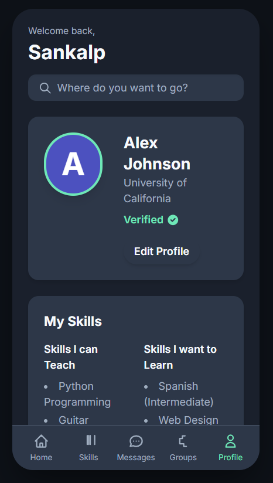

Peerskill is a platform designed to connect learners and mentors, enabling skill-sharing in a collaborative environment. It aims to bridge the gap between knowledge seekers and experts, making skill development accessible, interactive, and practical.

⸻

Importance

In today’s fast-paced world, learning new skills and improving existing ones is essential. Peerskill addresses the common challenges learners face:

	•	Difficulty in finding reliable guidance.
	•	Lack of personalized mentorship.
	•	Limited platforms to practice and exchange skills with peers.

By providing a centralized hub for peer-to-peer learning, Peerskill empowers individuals to enhance their knowledge, gain practical experience, and grow professionally and personally.

⸻

Key Features

	•	Peer-to-Peer Learning: Connect with others who want to learn or teach a skill.
	•	Skill Showcase: Users can display their expertise and achievements.
	•	Mentorship Opportunities: Find mentors in areas of interest for guidance and support.
	•	Interactive Feedback: Receive constructive feedback from peers to improve faster.
	•	Collaboration: Work on projects or challenges with other learners to apply skills practically.
	•	Community Growth: Engage in discussions, share resources, and grow with a like-minded community.
